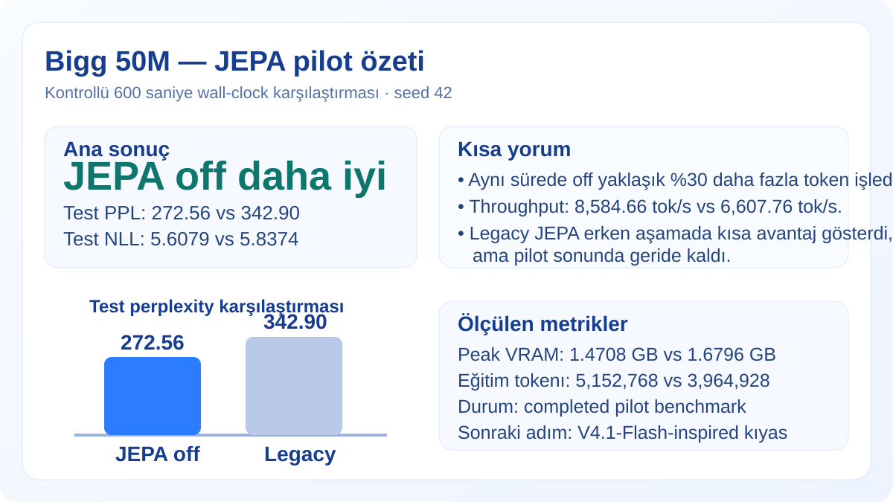
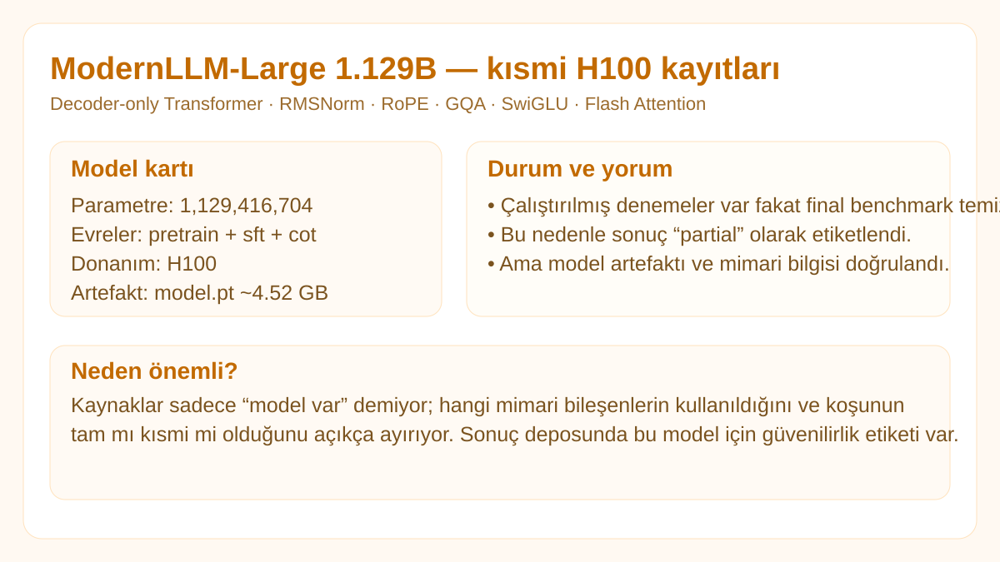
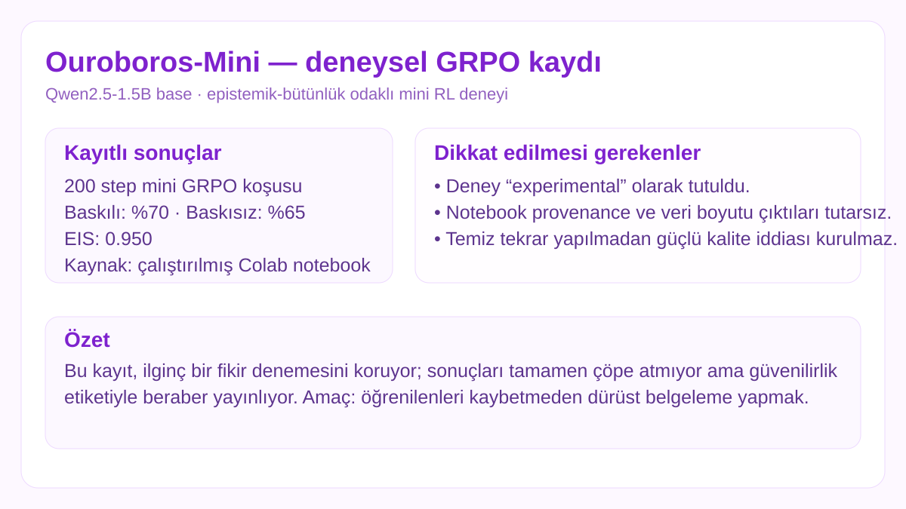

# Model Görsel Sonuç Kartları

Bu sayfa, sonuç deposundaki her ana model/çalışma için kısa ve görsel bir özet sunar. Amaç sadece markdown tabloları değil; **“ne denedik, ne çıktı, ne kadar güvenilir?”** sorularını hızlıca göstermek.

> Not: Kartlar nihai hakemli benchmark değildir. Her çalışma kendi güvenilirlik etiketiyle gösterilir: `completed`, `partial`, `experimental`, `self-reported` veya `trained tokenizer`.

## Bigg 50M

Ayrıntı: [`experiments/bigg-50m-jepa-vs-off/`](experiments/bigg-50m-jepa-vs-off/) · Kaynak: [cebrailbagatarhan/bigg](https://github.com/cebrailbagatarhan/bigg)

## Turkish Qwen2.5-7B QLoRA

Ayrıntı: [`models/turkish-qwen2.5-7b-qlora/`](models/turkish-qwen2.5-7b-qlora/) · [`experiments/turkish-qwen2.5-7b-qlora-200step/`](experiments/turkish-qwen2.5-7b-qlora-200step/)

## Turkmodel 6.08B

Ayrıntı: [`models/turkmodel-6.08b/`](models/turkmodel-6.08b/) · [`experiments/turkmodel-6.08b-h100-400step/`](experiments/turkmodel-6.08b-h100-400step/)

## ModernLLM-Large

Ayrıntı: [`models/modernllm-large/`](models/modernllm-large/) · [`experiments/modernllm-large-h100-partial/`](experiments/modernllm-large-h100-partial/)

## Ouroboros-Mini

Ayrıntı: [`models/ouroboros-mini/`](models/ouroboros-mini/) · [`experiments/ouroboros-mini-grpo/`](experiments/ouroboros-mini-grpo/)

## nanochat Windows CPU

Ayrıntı: [`models/nanochat-windows-cpu/`](models/nanochat-windows-cpu/) · [`experiments/nanochat-windows-cpu/`](experiments/nanochat-windows-cpu/)

## Car Evaluation ML

Ayrıntı: [`models/car-evaluation-ml/`](models/car-evaluation-ml/) · [`experiments/car-evaluation-7-models/`](experiments/car-evaluation-7-models/)

## Turkish BPE Tokenizer 128k

Ayrıntı: [`models/turkish-tokenizer-128k/`](models/turkish-tokenizer-128k/) · Kaynak: [TurkishTokenizer](https://github.com/cebrailbagatarhan/TurkishTokenizer)

---

## Nasıl okunmalı?

- **completed**: sonuç/metrik kaydı yeterince tamamlanmış.
- **completed training / no eval**: eğitim bitti fakat bağımsız değerlendirme yok.
- **partial**: koşu veya benchmark eksik/kesintili.
- **experimental**: ilginç fakat temiz tekrar gerektiren deney.
- **self-reported**: sonuç kaynak README/log anlatımından geliyor; ayrı ham doğrulama yok.

Bu görsellerin amacı sonucu süslemek değil, **sonucun ne anlama geldiğini ve ne anlama gelmediğini** daha hızlı anlatmaktır.