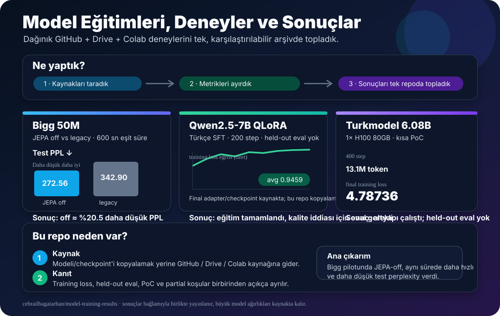

# Model Eğitimleri, Deneyler ve Sonuçlar

Bu depo; GitHub, Google Drive ve Colab üzerinde dağınık duran model eğitimlerini **tek yerde anlaşılır, karşılaştırılabilir ve kaynak bağlantılarıyla doğrulanabilir** hale getirmek için oluşturuldu.

<p align="center">
  
</p>

## Kısaca ne yaptık?

Farklı zamanlarda yapılmış model eğitimlerini ve deneyleri taradık; hangi modelin kullanıldığını, donanımı, eğitim bütçesini, görülebilen metrikleri ve deneyin gerçekten ne kadar tamamlanmış olduğunu ayırdık. Sonra bunları ortak bir yapıya taşıdık.

Buradaki amaç **model ağırlıklarını yeniden yüklemek değil**. Model/checkpoint dosyası nerede duruyorsa orada kalıyor; bu repo sonuçları, deney notlarını ve **asıl GitHub / Drive / Colab kaynak linklerini** bir araya getiriyor.

## Şu ana kadar ne öğrendik?

### 1. Bigg 50M pilotunda JEPA-off daha iyi çıktı

Aynı **600 saniyelik wall-clock bütçesinde**, seed `42` ile yapılan kontrollü pilotta JEPA kapalı sürüm (`off`) daha hızlı çalıştı ve daha iyi test sonucu verdi.

| Mod | Süre (s) | Eğitim tokenı | Token/s | Test NLL ↓ | Test PPL ↓ | Peak VRAM (GB) |
|---|---:|---:|---:|---:|---:|---:|
| **JEPA off** | 600.23 | 5,152,768 | **8,584.66** | **5.607873** | **272.563981** | **1.470829** |
| legacy JEPA | 600.04 | 3,964,928 | 6,607.76 | 5.837443 | 342.901316 | 1.679554 |

Bu koşulda `off`, aynı sürede yaklaşık **%30 daha fazla token** işledi ve test perplexity yaklaşık **%20.5 daha düşük** oldu. Legacy JEPA erken token bütçesinde kısa süreli sample-efficiency avantajı gösterdi ancak eğitim ilerledikçe bu avantaj kayboldu.

> Bu sonuç “JEPA genel olarak kötü” anlamına gelmez. Bu, yaklaşık 50M ölçekli, tek seed'li ve mevcut legacy JEPA implementasyonuna ait kontrollü pilot sonucudur.

Ayrıntılar: [`experiments/bigg-50m-jepa-vs-off/`](experiments/bigg-50m-jepa-vs-off/)

### 2. Turkish Qwen2.5-7B QLoRA eğitimi tamamlandı, fakat held-out eval eksik

Türkçe SFT için Qwen2.5-7B-Instruct tabanlı QLoRA koşusunda 200 step tamamlanmış eğitim kaydı ve adapter/checkpoint kaynakları var. Ortalama training loss yaklaşık `0.9459`. Ancak bağımsız held-out değerlendirme bulunmadığı için bunu model kalitesinin nihai kanıtı olarak sunmuyoruz.

Kaynak ve deney: [`models/turkish-qwen2.5-7b-qlora/`](models/turkish-qwen2.5-7b-qlora/) · [`experiments/turkish-qwen2.5-7b-qlora-200step/`](experiments/turkish-qwen2.5-7b-qlora-200step/)

### 3. Turkmodel 6.08B koşusu çalıştı ama çok kısa bir PoC

6.083B parametreli TR/EN model için `1× NVIDIA H100 80GB HBM3` üzerinde 400 step, yaklaşık 13.1M token ve `4.78736` final training loss kaydı var. Bu ölçeğe göre eğitim bütçesi çok küçük olduğu için sonuç **altyapı/öğrenme PoC'si** olarak tutuluyor; held-out eval yok.

Kaynak ve deney: [`models/turkmodel-6.08b/`](models/turkmodel-6.08b/) · [`experiments/turkmodel-6.08b-h100-400step/`](experiments/turkmodel-6.08b-h100-400step/)

### 4. ModernLLM-Large için gerçek model artefaktı var, fakat deneyler kısmi

ModernLLM-Large yaklaşık `1.129B` parametreli özel decoder-only Transformer. Drive'da model artefaktı ve H100 üzerinde çeşitli pretrain/SFT/CoT denemeleri bulunuyor; ancak kesintiler ve eksik final benchmark nedeniyle sonuç `partial` olarak işaretlendi.

Kaynak ve deney: [`models/modernllm-large/`](models/modernllm-large/) · [`experiments/modernllm-large-h100-partial/`](experiments/modernllm-large-h100-partial/)

## Envanter özeti

| Model/çalışma | Durum | Öne çıkan kayıt |
|---|---|---|
| Bigg 50M JEPA-off vs legacy | completed | JEPA-off: test NLL **5.607873**, PPL **272.56** |
| Bigg V4.1-Flash-inspired | pending | Yeni altyapı; kontrollü benchmark henüz yok |
| Turkish Qwen2.5-7B QLoRA | completed training / no eval | 200 step, avg train loss ~0.9459 |
| ModernLLM-Large 1.129B | partial | Kısmi H100 koşuları; final geçerli benchmark yok |
| Ouroboros-Mini | experimental | Mini eval EIS 0.950; provenance notları var |
| Turkmodel TR-EN 6.083B | short PoC | 400 step, train loss 4.78736 |
| nanochat Windows CPU | self-reported | Medium README sonucu 5.79 → 2.37 loss |
| Car Evaluation ML | completed | Decision Tree test accuracy %98.55 |
| Turkish BPE Tokenizer | trained tokenizer | 128k vocab; benchmark yok |

Tam liste: [`MODEL_INDEX.md`](MODEL_INDEX.md) · Deneyler: [`EXPERIMENT_INDEX.md`](EXPERIMENT_INDEX.md) · Kaynaklar: [`DRIVE_ARTIFACT_INDEX.md`](DRIVE_ARTIFACT_INDEX.md) · Makine-okunur envanter: [`benchmarks/model_inventory.csv`](benchmarks/model_inventory.csv)

## Repo nasıl okunmalı?

```text
model-training-results/
├── models/          # Model kartları: ne kullandık?
├── experiments/     # Deneyler: nasıl eğittik, ne çıktı?
├── benchmarks/      # Karşılaştırılabilir özet tablolar
├── datasets/        # Veri kaynakları ve split notları
├── environments/    # GPU / CUDA / PyTorch / ortam bilgileri
├── methodology/     # Değerlendirme ve tekrar üretilebilirlik kuralları
├── assets/          # Görsel özetler
└── *_INDEX.md       # Model, deney ve kaynak indeksleri
```

## Kaynak politikası

Model veya checkpoint dosyalarını gereksiz yere bu repoya kopyalamıyoruz. Her kayıt mümkün olduğunca **orijinal GitHub repo, Drive klasörü veya Colab notebook'una bağlantı** verir. Büyük binary dosyalar kaynağında kalır.

Public repoya credential, erişim anahtarı veya secret içeren notebook hücreleri taşınmaz. Training loss ile held-out eval birbirinden ayrılır; kesintili veya doğrulanmamış koşular `partial`, `experimental` ya da `self-reported` olarak açıkça etiketlenir.

## Sonraki hedef

Bigg için mevcut ölçülebilir baseline: **test NLL 5.607873 / PPL 272.563981**. Yeni V4.1-Flash-inspired mimari ve gelecekteki diğer modeller aynı veri/bütçe protokolünde bu baseline'a karşı değerlendirilecek.

Bu repo böylece yalnızca “hangi modeli yaptık?” sorusuna değil, **“hangi değişiklik gerçekten işe yaradı?”** sorusuna da cevap verecek.