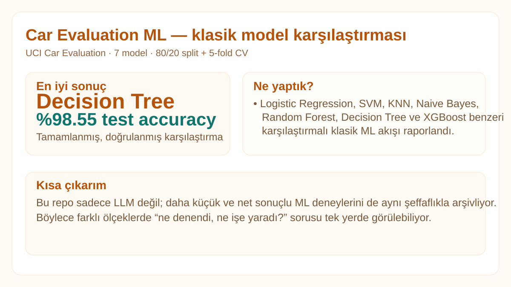

# Car Evaluation ML

  

**Durum:** `completed classical-ML comparison`

UCI Car Evaluation veri setinde 7 klasik makine öğrenmesi algoritmasının karşılaştırması. Kaynak: `cebrailbagatarhan/car-evaluation-ml`.

- 1,728 örnek
- 6 kategorik özellik
- 4 sınıf (`unacc`, `acc`, `good`, `vgood`)
- 80/20 train-test split
- 5-fold cross-validation
- Label encoding

En iyi test doğruluğu kaynak kayda göre **Decision Tree: %98.55**.

Ayrıntılı tablo: [`../../experiments/car-evaluation-7-models/`](../../experiments/car-evaluation-7-models/)

Tüm görsel kartlar: [`../../MODEL_VISUALS.md`](../../MODEL_VISUALS.md)
