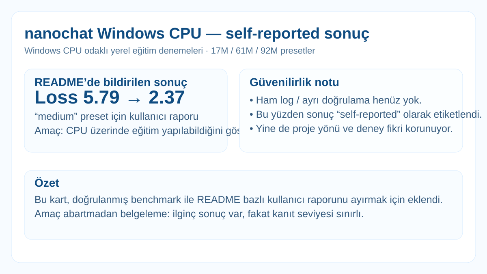

# nanochat — Windows CPU uyarlaması

  

**Durum:** `experimental / README-reported results`

Kaynak: `cebrailbagatarhan/nanochat-windows-cpu`.

Windows/CPU üzerinde küçük nanochat konfigürasyonlarını çalıştırmak için hazırlanmış uyarlama. Yerel README'de üç ölçek veriliyor:

| Preset | Yaklaşık parametre | Durum |
|---|---:|---|
| Fast | 17M | çalıştırıldığı raporlanmış |
| Medium | 61M | çalıştırıldığı raporlanmış |
| Max | 92M | test ediliyor |

Repo README'si upstream nanochat dokümantasyonuyla birleştirilmiş durumda; upstream 8×H100 benchmark tablosu yerel CPU sonuçlarıyla karıştırılmamalı. Bu arşiv yalnızca yerel CPU için açıkça raporlanan sonuçları kaydeder.

Ayrıntılar: [`../../experiments/nanochat-windows-cpu/`](../../experiments/nanochat-windows-cpu/)

Tüm görsel kartlar: [`../../MODEL_VISUALS.md`](../../MODEL_VISUALS.md)
