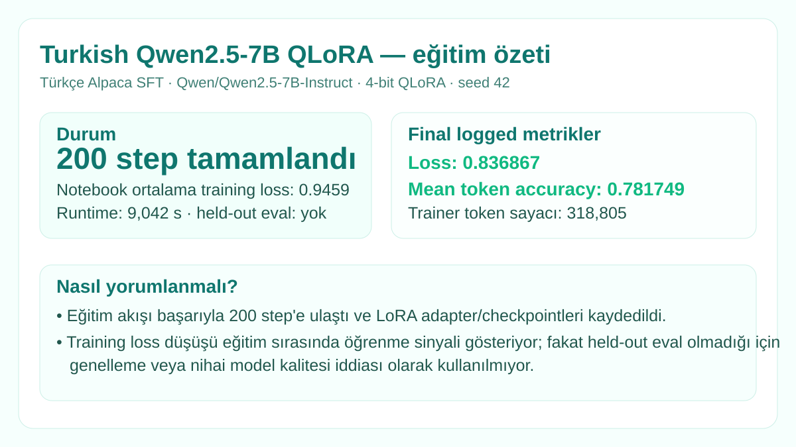

# Turkish Qwen2.5-7B QLoRA

  

**Durum:** `completed training / no held-out eval`

Google Colab üzerinde `Qwen/Qwen2.5-7B-Instruct` tabanına Türkçe Alpaca verisiyle QLoRA/SFT uygulanmış deney.

## Kullanılanlar

| Alan | Değer |
|---|---|
| Base model | Qwen/Qwen2.5-7B-Instruct |
| Quantization | 4-bit NF4, double quant, BF16 compute |
| LoRA | r=8, alpha=16, dropout=0.05 |
| Target modules | q/k/v/o + gate/up/down proj |
| Trainable parametre | 20,185,088 (~%0.46) |
| Veri | `malhajar/alpaca-gpt4-tr` |
| Veri boyutu | 52,002 örnek |
| Max length | 1,024 |
| Seed | 42 |

Drive'da LoRA adapter ağırlığı (`adapter_model.safetensors`, ~40.4 MB), tokenizer/config dosyaları ve 50/100/150/200 checkpoint'leri doğrulandı. Binary ağırlıklar bu public sonuç deposuna kopyalanmadı.

Ayrıntılı koşu: [`../../experiments/turkish-qwen2.5-7b-qlora-200step/`](../../experiments/turkish-qwen2.5-7b-qlora-200step/)

Tüm görsel kartlar: [`../../MODEL_VISUALS.md`](../../MODEL_VISUALS.md)
