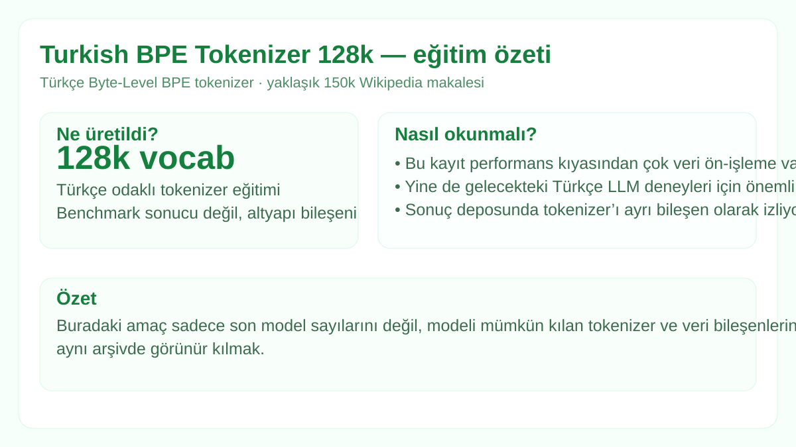

# Turkish BPE Tokenizer — 128k

  

**Durum:** `trained tokenizer / no tokenizer benchmark archived`

Kaynak: `cebrailbagatarhan/TurkishTokenizer`.

- Tip: Byte-Level BPE
- Vocabulary: 128,000
- Eğitim verisi: Hugging Face `wikimedia/wikipedia` (`20231101.tr`)
- Yaklaşık veri kapsamı: 150,000 Türkçe makale
- Özel tokenlar: `<|begin_of_sentence|>`, `<|end_of_sentence|>`, `<|pad|>`, `<|unk|>`

Bu kayıt model ağırlığı değil tokenizer envanteridir. Token/karakter oranı, fertility veya diğer tokenizer benchmarkları kaynak kayıtta verilmediği için sonuç uydurulmamıştır.

Tüm görsel kartlar: [`../../MODEL_VISUALS.md`](../../MODEL_VISUALS.md)
