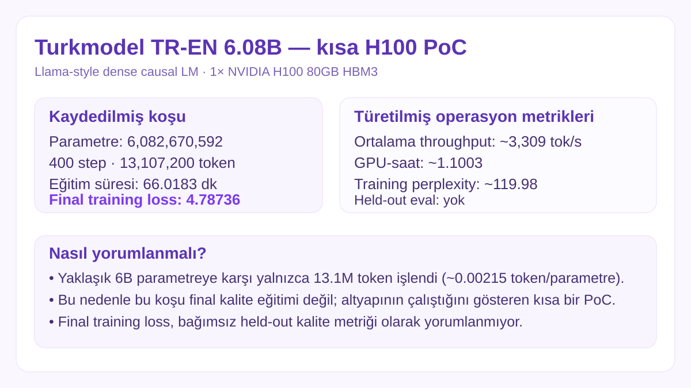

# Turkmodel — 6.08B TR/EN kısa H100 koşusu

  

**Durum:** `trained PoC / weights preserved / no held-out eval`

Kaynak repo: `cebrailbagatarhan/turkmodel`.

## Mimari

| Alan | Değer |
|---|---:|
| Parametre | 6,082,670,592 |
| Vocab | 50,257 |
| Hidden | 4,096 |
| Intermediate | 11,008 |
| Katman | 32 |
| Attention head | 32 |
| KV head | 8 |
| Context | 2,048 |
| Precision | BF16 |
| Mimari | Llama-style dense causal LM |

Attention yolu FlashAttention 2 kurulmuşsa onu, aksi halde PyTorch SDPA'yı kullanacak şekilde yapılandırılmış; optimizer 8-bit AdamW olarak ayarlı.

Kaydedilmiş koşu yalnızca 400 step / 13.1M token olduğundan model ölçeğine göre çok kısa bir smoke/PoC eğitimidir.

## Drive artefaktları

Google Drive'daki `LLM_Training` arşivinde checkpoint-100/200/300/400 ve `final_model` bulundu. Final klasöründe yaklaşık **12.17 GB `model.safetensors`**, tokenizer/config ve `training_info.json` var. Büyük binary ağırlık bu public sonuç reposuna kopyalanmadı; burada yalnızca doğrulanmış envanter ve metrik kaydı tutuluyor.

Ayrıntılar: [`../../experiments/turkmodel-6.08b-h100-400step/`](../../experiments/turkmodel-6.08b-h100-400step/)

Tüm görsel kartlar: [`../../MODEL_VISUALS.md`](../../MODEL_VISUALS.md)
